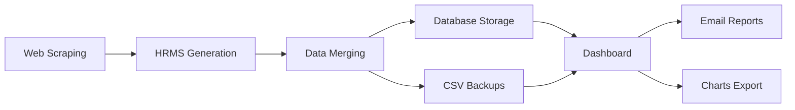

# HR Attrition Intelligence Dashboard

A comprehensive HR analytics platform that combines ETL data processing with interactive dashboards and automated reporting. The system scrapes public employee reviews, generates synthetic HRMS data, performs data enrichment, and provides visualization through a Streamlit dashboard with scheduled reporting capabilities.

## 🚀 Features

### Core ETL Pipeline
- **Incremental Web Scraping**: Automated scraping of employee reviews with page checkpointing
- **Synthetic Data Generation**: Creates realistic HRMS data aligned with scraped review volumes
- **Data Enrichment & Merging**: Combines review data with HRMS attributes for comprehensive analysis
- **Multi-format Storage**: CSV backups with timestamps + SQLite database persistence

### Dashboard & Visualization
- **Interactive Streamlit Dashboard**: Real-time data visualization and analytics
- **Custom Chart Generation**: Dynamic charts and reports with export capabilities
- **Configuration Management**: Persistent settings and user preferences

### Automation & Scheduling
- **Intelligent Scheduler**: Automated pipeline execution with configurable timing
- **Email Reporting**: Scheduled PDF report generation and distribution
- **Pipeline Monitoring**: Logging and status tracking for all processes

### Integration Capabilities
- **Google Workspace Integration**: Google Sheets and Drive connectivity
- **Database Support**: SQLite and PostgreSQL compatibility
- **API Endpoints**: RESTful interfaces for data access

## 📁 Project Structure

```
hr-attrition-intelligence1/
├── data/                                    # Data storage and outputs
│   ├── *.csv                               # Review and HRMS data files
│   └── hr_analytics.db                     # SQLite database
├── etl/                                    # ETL pipeline components
│   ├── reviews_scraper.py                  # Web scraping engine
│   ├── internal_hrms_data_generator.py     # Synthetic HRMS data creation
│   ├── data_merger.py                      # Data enrichment and merging
│   ├── push.py                             # Data persistence and uploads
│   ├── Email_Report.py                     # Automated email reporting
│   ├── utils.py                            # Shared utilities and helpers
│   ├── charts/                             # Generated visualizations
│   └── hr_imgs/                            # Image assets and exports
├── sql/                                    # Database management
│   ├── schema.sql                          # Database schema definitions
│   └── setup_db.py                         # Database initialization script
├── Backup/                                 # Timestamped data backups
│   ├── reviews/                            # Review data archives
│   └── hrms/                               # HRMS data archives
├── charts/                                 # Dashboard chart outputs
├── dashboard.py                            # Streamlit dashboard application
├── main.py                                 # ETL pipeline orchestrator
├── scheduler.py                            # Automated scheduling system
├── requirements.txt                        # Python dependencies
├── dashboard_config.json                   # Dashboard configuration
└── *.log                                   # System logs and monitoring
```

## 🛠️ Installation & Setup

### 1. Environment Setup
```bash
# Clone and navigate to project
cd hr-attrition-intelligence1

# Create virtual environment
python3 -m venv venv
source venv/bin/activate  # On Windows: venv\Scripts\activate

# Install dependencies
pip install -r requirements.txt
```

### 2. Database Initialization
```bash
# Initialize SQLite database with schema
python sql/setup_db.py
```

### 3. Configuration
- Update company parameters in `etl/reviews_scraper.py`
- Configure email settings in `dashboard_config.json` (created automatically)
- Set up Google API credentials if using Google integrations (optional)

## 🚀 Usage

### Quick Start - Run Complete Pipeline
```bash
python main.py
```
This executes the full ETL workflow:
1. **Scraping**: Extracts employee reviews and saves to `data/<company>_reviews.csv`
2. **HRMS Generation**: Creates/extends synthetic HR data in `data/hrms_latest.csv`
3. **Data Merging**: Enriches reviews with HRMS attributes → `data/reviews_enriched_latest.csv`
4. **Database Storage**: Persists new records to SQLite database
5. **Backup Creation**: Timestamped backups in `Backup/` directory

### Interactive Dashboard
```bash
streamlit run dashboard.py
```

Features:
- 📊 **Real-time Analytics**: Interactive charts and KPIs
- 🔄 **Pipeline Control**: Run ETL processes on-demand
- 📧 **Report Management**: Schedule and configure email reports
- ⚙️ **Settings**: Manage schedules and configurations
- 📈 **Data Visualization**: Custom charts with export options

### Automated Scheduling

#### Simple Daily Schedule
```bash
python scheduler.py
```
- Default: Runs daily at 12:30 PM
- Customize time via `SCHEDULE_TIME` environment variable

#### Advanced Scheduling (Dashboard)
Use the Streamlit dashboard for:
- Custom schedule configuration
- Email report automation
- Pipeline monitoring and logs

## 📊 Data Flow



## ⚙️ Configuration Options

### ETL Pipeline Settings
- **Company Target**: Configure in `etl/reviews_scraper.py`
- **Scraping Parameters**: Page limits, delays, retry logic
- **Data Generation**: HRMS record volumes and attributes

### Dashboard Settings
- **Email Recipients**: Managed through dashboard interface
- **Report Scheduling**: Configurable timing and frequency
- **Chart Preferences**: Colors, formats, export options

### Database Configuration
- **SQLite** (default): Local file-based storage
- **PostgreSQL**: Configure connection string in environment variables

## 📧 Email Reporting

Automated PDF report generation with:
- Executive summaries and KPIs
- Trend analysis and visualizations
- Data quality metrics
- Customizable recipient lists and schedules

## 🔐 Security & Best Practices

- **Environment Variables**: Store sensitive credentials securely
- **TLS Verification**: Enable for production deployments
- **API Rate Limiting**: Implemented in scraping modules
- **Data Backup**: Automated timestamped backups
- **Error Handling**: Comprehensive logging and recovery

## 📝 Logging & Monitoring

- **Console Output**: Real-time process status
- **File Logs**: `scheduled_pipelines.log`, `scheduled_reports.log`
- **Error Tracking**: Detailed error messages and stack traces
- **Performance Metrics**: Execution times and data volumes

## 🔧 Advanced Usage

### Custom Integrations
- **Google Sheets**: Automatic data sync and reporting
- **Google Drive**: Backup and file management
- **Custom APIs**: Extend with additional data sources

### Development
```bash
# Run specific ETL components
python etl/reviews_scraper.py
python etl/internal_hrms_data_generator.py
python etl/data_merger.py

# Database operations
python sql/setup_db.py  # Initialize/reset database
```

## 🚦 System Requirements

- **Python**: 3.8+ (3.9+ recommended)
- **Memory**: 4GB+ RAM for large datasets
- **Storage**: 1GB+ free space for data and backups
- **Network**: Reliable internet for web scraping

## 📋 Dependencies

### Core Libraries
- **pandas**: Data manipulation and analysis
- **requests**: HTTP client for web scraping
- **beautifulsoup4**: HTML parsing
- **streamlit**: Dashboard framework
- **sqlalchemy**: Database abstraction

### Visualization
- **matplotlib**: Chart generation
- **seaborn**: Statistical visualizations
- **reportlab**: PDF report generation

### Automation
- **schedule**: Job scheduling
- **faker**: Synthetic data generation
- **google-api-python-client**: Google services integration

## 🤝 Contributing

1. Fork the repository
2. Create feature branches for new functionality
3. Follow PEP 8 style guidelines
4. Add unit tests for new features
5. Update documentation as needed

## 🐛 Troubleshooting

### Common Issues
- **Scraping Failures**: Check internet connection and target site availability
- **Database Errors**: Verify SQLite file permissions and disk space
- **Dashboard Issues**: Ensure all dependencies installed and ports available
- **Email Delivery**: Validate SMTP settings and recipient addresses

### Debug Mode
Add verbose logging by setting environment variable:
```bash
export DEBUG=1
python main.py
```

## 📄 License

Private/internal project. Add appropriate license terms if planning to open source.

---

**Version**: 2.0.0  
**Last Updated**: December 2024  
**Contact**: Development Team