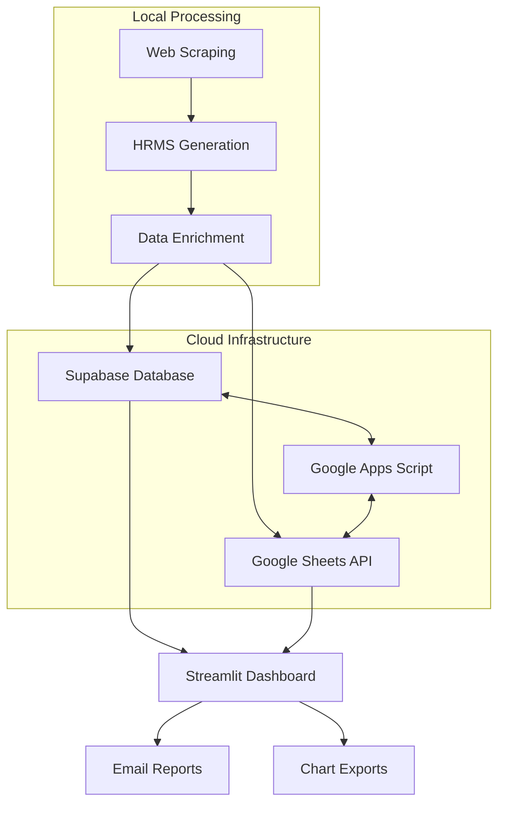

# HR Attrition Intelligence Dashboard

A comprehensive HR analytics platform that combines ETL data processing with cloud-based storage and interactive dashboards. The system scrapes public employee reviews, generates synthetic HRMS data, performs data enrichment, and provides real-time visualization through a Streamlit dashboard with integrated cloud database and Google Sheets synchronization.

## 🚀 Features

### Core ETL Pipeline
- **Incremental Web Scraping**: Automated scraping of employee reviews with page checkpointing
- **Synthetic Data Generation**: Creates realistic HRMS data aligned with scraped review volumes
- **Data Enrichment & Merging**: Combines review data with HRMS attributes for comprehensive analysis
- **Cloud Database Storage**: Supabase PostgreSQL for scalable, real-time data persistence
- **Google Sheets Integration**: Automated backup and synchronization via Google Sheets API

### Dashboard & Visualization
- **Interactive Streamlit Dashboard**: Real-time data visualization and analytics
- **Custom Chart Generation**: Dynamic charts and reports with export capabilities
- **Integrated Scheduling**: Built-in pipeline and report scheduling within the dashboard
- **Configuration Management**: Persistent settings and user preferences

### Cloud Integration & Synchronization
- **Supabase Database**: Cloud-native PostgreSQL with real-time capabilities
- **Google Sheets Backup**: Automated data backup to Google Sheets
- **App Script Sync**: Bidirectional synchronization between database and sheets
- **Real-time Updates**: Live data synchronization across all platforms

### Automation & Reporting
- **Dashboard-Controlled Scheduling**: All scheduling managed through Streamlit interface
- **Email Reporting**: Automated PDF report generation and distribution
- **Pipeline Monitoring**: Real-time status tracking and logging
- **Cloud-based Persistence**: All configurations stored in cloud database

## 📁 Project Structure

```
hr-attrition-intelligence1/
├── data/                                    # Local data cache and temporary files
│   └── *.csv                               # Temporary CSV files for processing
├── etl/                                    # ETL pipeline components
│   ├── reviews_scraper.py                  # Web scraping engine
│   ├── internal_hrms_data_generator.py     # Synthetic HRMS data creation
│   ├── data_merger.py                      # Data enrichment and merging
│   ├── push.py                             # Supabase and Sheets integration
│   ├── Email_Report.py                     # Automated email reporting
│   ├── utils.py                            # Shared utilities and helpers
│   ├── charts/                             # Generated visualizations
│   └── hr_imgs/                            # Image assets and exports
├── sql/                                    # Database schema (for reference)
│   └── schema.sql                          # Database schema definitions
├── Backup/                                 # Local backup directory
│   ├── reviews/                            # Review data archives
│   └── hrms/                               # HRMS data archives
├── charts/                                 # Dashboard chart outputs
├── dashboard.py                            # Streamlit dashboard application
├── main.py                                 # ETL pipeline orchestrator
├── requirements.txt                        # Python dependencies
├── dashboard_config.json                   # Local dashboard configuration cache
└── *.log                                   # System logs and monitoring
```

## 🛠️ Installation & Setup

### 1. Environment Setup
```bash
# Clone and navigate to project
cd hr-attrition-intelligence1

# Create virtual environment
python3 -m venv venv
source venv/bin/activate  # On Windows: venv\Scripts\activate

# Install dependencies
pip install -r requirements.txt
```

### 2. Cloud Services Configuration

#### Supabase Setup
```bash
# Set environment variables
export SUPABASE_URL=your_supabase_project_url
export SUPABASE_KEY=your_supabase_anon_key
export SUPABASE_SERVICE_KEY=your_supabase_service_key
```

#### Google Sheets Integration
1. Create a Google Cloud Project
2. Enable Google Sheets API and Google Drive API
3. Create service account credentials
4. Download credentials JSON file
5. Share your Google Sheet with the service account email

```bash
# Set Google credentials
export GOOGLE_CREDENTIALS_PATH=path/to/your/credentials.json
export GOOGLE_SHEET_ID=your_google_sheet_id
```

### 3. Database Schema
The Supabase database will be automatically initialized with the required schema when you first run the pipeline. The schema includes:
- `reviews_enriched`: Main data table with enriched employee reviews
- `pipeline_logs`: Execution logs and monitoring data
- `schedule_config`: Dashboard scheduling configuration

## 🚀 Usage

### Interactive Dashboard (Primary Interface)
```bash
streamlit run dashboard.py
```

**Dashboard Features:**
- 📊 **Real-time Analytics**: Live charts connected to Supabase
- 🔄 **Pipeline Control**: Run ETL processes on-demand
- ⏰ **Integrated Scheduling**: Configure automated runs within the dashboard
- 📧 **Email Reports**: Schedule and manage automated reports
- 🔄 **Data Sync**: Monitor Supabase ↔ Google Sheets synchronization
- ⚙️ **Cloud Settings**: Manage all configurations through the interface

### Manual Pipeline Execution
```bash
python main.py
```

**Pipeline Steps:**
1. **Web Scraping**: Extracts employee reviews from target websites
2. **HRMS Generation**: Creates synthetic HR data matching review volumes
3. **Data Enrichment**: Merges reviews with HRMS attributes
4. **Cloud Upload**: Pushes data to Supabase database
5. **Sheets Backup**: Syncs data to Google Sheets via API
6. **App Script Trigger**: Activates bidirectional sync via Google Apps Script

## 📊 Data Flow Architecture



## 🔄 Cloud Integration Details

### Supabase Database
- **Real-time Updates**: Live data synchronization with dashboard
- **Scalable Storage**: PostgreSQL-based cloud database
- **API Integration**: RESTful API for data operations
- **Security**: Row-level security and authentication

### Google Sheets Integration
- **Automated Backup**: All data automatically synced to Google Sheets
- **Manual Access**: Business users can access data directly in familiar spreadsheet format
- **App Script Sync**: Bidirectional synchronization ensures data consistency
- **Version Control**: Historical data preservation in sheets format

### Synchronization Flow
1. **ETL Pipeline** → **Supabase Database** (Primary storage)
2. **Supabase** → **Google Sheets** (Via API push)
3. **Google Apps Script** ↔ **Sheets** ↔ **Database** (Bidirectional sync)
4. **Dashboard** reads from **Supabase** for real-time visualization

## ⚙️ Configuration & Scheduling

### Dashboard-Based Scheduling
All scheduling is managed through the Streamlit dashboard:

- **Pipeline Schedules**: Configure automated ETL runs
- **Report Schedules**: Set up recurring email reports  
- **Sync Monitoring**: Track database-sheets synchronization
- **Cloud Configuration**: Manage Supabase and Google API settings

### Configuration Storage
- **Cloud-First**: Primary configuration stored in Supabase
- **Local Cache**: `dashboard_config.json` for offline access
- **Environment Variables**: Sensitive credentials via environment

## 📧 Email Reporting System

**Automated Features:**
- **Cloud-Generated Reports**: Reports pull data directly from Supabase
- **Real-time Data**: Always uses latest synchronized data
- **PDF Generation**: Professional reports with charts and analytics
- **Flexible Scheduling**: Configure frequency and recipients via dashboard
- **Delivery Tracking**: Monitor email delivery status

## 🔐 Security & Best Practices

### Cloud Security
- **Environment Variables**: All sensitive keys stored securely
- **Service Account Auth**: Google Sheets access via service accounts
- **Row-Level Security**: Supabase RLS policies for data protection
- **API Key Management**: Secure key rotation and management

### Data Protection
- **Encrypted Transit**: All data transfers use HTTPS/TLS
- **Backup Redundancy**: Multiple backup locations (Supabase + Sheets)
- **Access Controls**: Granular permissions for different user roles
- **Audit Logging**: Complete activity tracking in cloud database

## 📝 Monitoring & Logging

### Real-time Monitoring
- **Dashboard Status**: Live pipeline status in Streamlit interface
- **Cloud Logs**: Comprehensive logging in Supabase database
- **Sync Status**: Real-time database-sheets synchronization monitoring
- **Performance Metrics**: Execution times and data volume tracking

### Log Storage
- **Cloud-Primary**: Main logs stored in Supabase for persistence
- **Local Backup**: `*.log` files for offline access
- **Google Sheets**: Sync status and history in dedicated sheet tabs

## 🔧 Advanced Features

### Google Apps Script Integration
The system uses Google Apps Script for advanced sheet-database synchronization:

```javascript
// Example Apps Script function (deployed separately)
function syncToDatabase() {
  // Reads sheet data
  // Calls Supabase API
  // Maintains bidirectional sync
}
```

### API Endpoints
- **Supabase REST API**: Full CRUD operations on all data
- **Google Sheets API**: Read/write access to backup sheets
- **Custom Webhooks**: Trigger pipeline runs via API calls

## 🚦 System Requirements

### Cloud Dependencies
- **Supabase Account**: For primary database storage
- **Google Cloud Project**: For Sheets API access
- **Stable Internet**: For real-time cloud synchronization

### Local Requirements
- **Python**: 3.8+ (3.9+ recommended)
- **Memory**: 4GB+ RAM for data processing
- **Storage**: 1GB+ for temporary files and local cache
- **Network**: Reliable connection for cloud operations

## 📋 Dependencies

### Core Libraries
- **pandas**: Data manipulation and analysis
- **requests**: HTTP client for web scraping and API calls
- **streamlit**: Dashboard framework
- **supabase**: Python client for Supabase database
- **gspread**: Google Sheets API integration

### Cloud Integration
- **google-api-python-client**: Google services SDK
- **google-auth**: Google authentication
- **psycopg2**: PostgreSQL adapter (for Supabase)
- **python-dotenv**: Environment variable management

### Visualization & Reporting
- **matplotlib**: Chart generation
- **seaborn**: Statistical visualizations  
- **reportlab**: PDF report generation
- **plotly**: Interactive dashboard charts

## 🐛 Troubleshooting

### Common Cloud Issues
- **Supabase Connection**: Verify URL and API keys in environment
- **Google Sheets Access**: Check service account permissions and sheet sharing
- **Sync Failures**: Monitor Apps Script execution logs
- **Dashboard Errors**: Check cloud connectivity and credentials

### Debug Tools
```bash
# Enable verbose logging
export DEBUG=1
python main.py

# Test cloud connections
python -c "from etl.push import test_connections; test_connections()"
```

### Monitoring Dashboard Health
The Streamlit dashboard includes built-in health checks for:
- Supabase database connectivity
- Google Sheets API access
- Apps Script sync status
- Pipeline execution history

## 🤝 Contributing

1. **Fork Repository**: Create your own copy
2. **Cloud Setup**: Configure your own Supabase and Google Cloud instances
3. **Feature Development**: Test against cloud staging environment
4. **Documentation**: Update both code and cloud configuration docs
5. **Pull Request**: Include cloud setup instructions for reviewers

## 📊 Data Schema

### Supabase Tables
- `reviews_enriched`: Main analytical dataset
- `pipeline_logs`: Execution and error logs
- `schedule_config`: Dashboard scheduling settings
- `sync_status`: Google Sheets synchronization tracking

### Google Sheets Structure
- **Sheet 1**: Latest enriched data (synced from Supabase)
- **Sheet 2**: Pipeline execution logs
- **Sheet 3**: Historical data archive
- **Sheet 4**: Configuration backup

## 📄 License

Private/internal project with cloud infrastructure components. Add appropriate license terms considering cloud service usage and data handling requirements.

---

**Version**: 3.0.0 (Cloud-Native)  
**Last Updated**: December 2024  
**Architecture**: Supabase + Google Sheets + Streamlit  
**Contact**: Development Team

## 🆘 Quick Start Checklist

- [ ] Environment variables configured (Supabase + Google)
- [ ] Google service account created and sheet shared
- [ ] Supabase project created and configured
- [ ] Python dependencies installed
- [ ] Dashboard launched: `streamlit run dashboard.py`
- [ ] First pipeline run completed successfully
- [ ] Data visible in both Supabase and Google Sheets
- [ ] Email reporting configured and tested